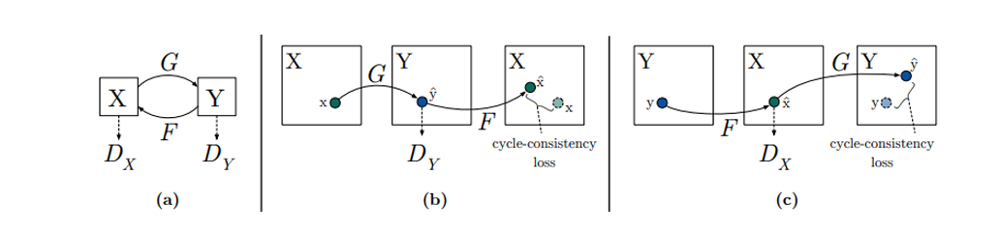
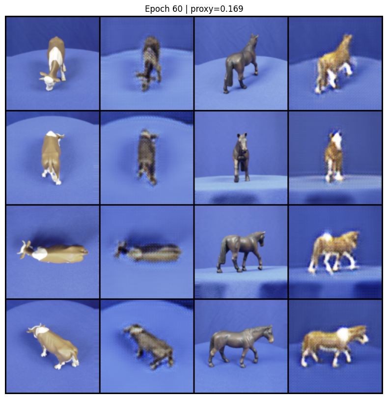
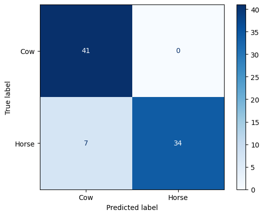

# 🐄🐎 Cow vs Horse Classification
### Transfer Learning · DCGAN · CycleGAN


---

## 📌 Overview

A systematic study of **binary image classification** between **Cows 🐄** and **Horses 🐎** using a severely limited dataset of only **170 images**. We progressively explored five strategies — from a naive baseline CNN to generative adversarial networks — to understand how modern deep learning techniques address extreme data scarcity.

> **🏆 Best Test Accuracy: 91.46%** — achieved via Transfer Learning with ImageNet pretraining.

---

## 📂 Project Structure

```text
├── notebook/
│   └── Notebookt.ipynb   
├── report/
│   ├── report.pdf                          
│   ├── DC_LOSES.png                 
│   ├── DCGAN_RESULT.png            
│   ├── CYCLE_GAN.png                
│   ├── CYCLE_GAN_loses.png          
│   ├── CYCLE_GAN_RESULT.png         
│   └── classifier_confusion_matrix.png                 
│       
├── requirements.txt
└── README.md
```

---

## 📊 Dataset

| Property | Value |
|---|---|
| Total images | 170 |
| Training set | 82 |
| Test set | 82 |
| Classes | Cow / Horse |
| Class balance | Approximately equal |
| Format | RGB, variable resolution |

All images were resized to **64×64** for GAN training and **224×224** for transfer learning models. Standard augmentation (horizontal flipping, random cropping, colour jitter) was applied during classifier training.

---

## 🧠 Methods

### 1️⃣ Baseline CNN

A shallow CNN trained from random initialisation: three convolutional blocks (Conv–BN–ReLU–MaxPool), followed by a fully-connected classifier with softmax output.

- **Result:** Training accuracy quickly reached 90%+, but test accuracy stagnated between **55–70%** — a clear sign of overfitting.

---

### 2️⃣ Regularised CNN

Built on the baseline by adding dropout (`p=0.5`), L2 weight decay, and expanded data augmentation.

- **Result:** Test accuracy improved to approximately **73%** — confirming that regularisation alone partially mitigates overfitting but remains insufficient at this dataset scale.

---

### 3️⃣ Transfer Learning ⭐ Best Model

Leveraged ImageNet-pretrained CNN backbones (ResNet18 / EfficientNet) using a two-stage fine-tuning protocol.

| Stage | Action | Learning Rate |
|---|---|---|
| **Stage A** — Warm-up | Freeze backbone, train classifier head only | `1e-3` |
| **Stage B** — Fine-tuning | Unfreeze upper layers, train end-to-end with cosine annealing | `1e-5` |

Early stopping on validation loss was applied in Stage B to prevent re-overfitting.

#### Per-Class Metrics (Real Images Only):

| Class | Precision | Recall | F1-score |
|---|---|---|---|
| Cow | 0.85 | 1.00 | 0.92 |
| Horse | 1.00 | 0.83 | 0.91 |
| **Macro avg.** | **0.93** | **0.92** | **0.92** |

- High **precision for horses** (no false positives).
- Perfect **recall for cows** (no missed detections).
- **Result: 91.46% test accuracy** — 21+ percentage points above the regularised CNN.

---

### 4️⃣ DCGAN — Synthetic Image Generation

A Deep Convolutional GAN was trained separately on cow and horse images to learn the data distribution and generate novel synthetic samples.

**Objective (minimax):**

$$\min_G \max_D \; \mathbb{E}[\log D(x)] + \mathbb{E}[\log(1 - D(G(z)))]$$

**Architecture:**
- **Generator:** 5 transposed convolution layers upsampling from 4×4 → 64×64, with Batch Normalisation + ReLU; final layer uses `tanh`.
- **Discriminator:** Mirrors the generator with strided convolutions, ending with a sigmoid unit.

**Training observations:** The discriminator initially converged faster than the generator, causing temporary instability. Both networks eventually stabilised.

**Result:** Generated images were blurry and lacked fine detail. Appending synthetic images to the real training set did **not** consistently improve classifier accuracy. GANs generally require thousands of samples to learn high-fidelity distributions; with only 82 images, mode collapse and blurry outputs degraded effective data quality.

- **Best augmented accuracy: 75.61%**

---

### 5️⃣ CycleGAN — Unpaired Style Transfer

CycleGAN performs **unpaired bidirectional image-to-image translation** between two domains without requiring pixel-aligned pairs. Two generators and two discriminators are trained jointly.

| Component | Role |
|---|---|
| `G : X → Y` | Cow → Horse generator |
| `F : Y → X` | Horse → Cow generator |
| `D_Y` | Distinguishes real vs. fake horses |
| `D_X` | Distinguishes real vs. fake cows |

##CycleGAN model architecture


**Loss components:**

$$\mathcal{L} = \mathcal{L}_{\text{GAN}}(G,D_Y) + \mathcal{L}_{\text{GAN}}(F,D_X) + \lambda_{\text{cyc}}\,\mathcal{L}_{\text{cyc}} + \lambda_{\text{id}}\,\mathcal{L}_{\text{id}}$$

with λ_cyc = 10 and λ_id = 5 (following the original paper).

**Training observations:** CycleGAN converged significantly more stably than DCGAN. Because the generator receives a full structural image rather than random noise, it only needs to learn *appearance transfer* — a substantially easier task, particularly under data scarcity.

**Visual results:** The model successfully transferred coat texture and colour while preserving body pose, scene layout, and background content. Minor texture artefacts remain near animal boundaries.

#### CycleGAN as a Classifier Training Source (Augmentation Experiment)

As a final experiment, **80 translated images** (40 Cow→Horse + 40 Horse→Cow) were appended to the 82 real training images (combined set: 162 samples). A fresh ResNet18 was trained on this combined dataset using the same two-stage fine-tuning protocol.

| Class | Precision | Recall | F1-score |
|---|---|---|---|
| Cow | 0.64 | 0.85 | 0.73 |
| Horse | 0.78 | 0.51 | 0.62 |
| **Macro avg.** | **0.71** | **0.68** | **0.67** |

- Training accuracy reached **99.4%** in Stage B.
- **Test accuracy dropped to 68.29%** — a loss of 23+ percentage points vs. the real-data-only baseline.

**Three factors explain this degradation:**

1. **Domain shift** — CycleGAN images were generated at 128×128 and up-sampled to 224×224, introducing interpolation artefacts absent from real images.
2. **Texture bias** — Translated images share texture characteristics from the source domain (e.g., a cow-shaped silhouette with horse colouring), confusing the classifier.
3. **Distribution mismatch** — With only 82 real images, the CycleGAN generators are themselves imperfectly trained; translated images do not faithfully represent the target class distribution, effectively adding label noise.

---

## 🆚 DCGAN vs. CycleGAN Comparison

| Property | DCGAN | CycleGAN |
|---|---|---|
| Input | Noise `z ~ p_z` | Real image `x` |
| Output | Synthesised image | Domain-translated image |
| Generators | 1 | 2 (`G` and `F`) |
| Discriminators | 1 | 2 (`D_X` and `D_Y`) |
| Auxiliary losses | None | Cycle + Identity |
| Small-data suitability | Low | Moderate–High |
| Training stability | Unstable | Stable |
| Main use case | Unconditional generation | Style / domain transfer |

---

## 📈 Results Summary

| Experiment | Test Accuracy |
|---|---|
| Baseline CNN (from scratch) | 55–70% |
| Regularised CNN (dropout + L2) | ~73% |
| DCGAN Augmentation (best run) | 75.61% |
| **Transfer Learning (final)** ⭐ | **91.46%** |
| CycleGAN Augmentation + Transfer Learning | 68.29% |

---

## 🖼️ Example Outputs


### CycleGAN Translation Results — Cow ↔ Horse



### Confusion Matrix



---

## 🚀 How to Run

```bash
# Clone the repository
git clone <your-repo-url>
cd <repo-folder>

# Install dependencies
pip install -r requirements.txt

# Launch the notebook
jupyter notebook notebook/Notebook.ipynb
```

---

## 📦 Requirements

```text
Python 3.10+
torch
torchvision
numpy
matplotlib
scikit-learn
pillow
jupyter
```

Install all at once:

```bash
pip install -r requirements.txt
```

---

## 💡 Key Findings

1. **Transfer learning dominates** — Pretrained ImageNet features dramatically reduce data requirements. The two-stage fine-tuning protocol was critical to prevent head initialisation from corrupting backbone features.
2. **GAN quality > GAN quantity** — More synthetic data does not always improve accuracy. Low-fidelity GAN samples actively hurt classifier performance.
3. **CycleGAN is more stable than DCGAN** — Cycle-consistency and identity losses constrain training and make CycleGAN far better suited to small-dataset regimes.
4. **CycleGAN augmentation hurt classification** — Despite visually impressive style transfer, translated images introduced domain shift, texture ambiguity, and label noise that outweighed any benefit from increased dataset size.
5. **Generative and discriminative goals are separate** — Strong visual translation does not imply useful augmentation for classification. Transfer learning handles classification; GANs handle style transfer.

---

## 🔮 Future Work

- Collect a larger, more diverse annotated dataset
- Explore **semi-supervised learning** to leverage unlabelled data
- Replace DCGAN with **WGAN-GP** or **StyleGAN** for higher-quality generation
- Explore **Diffusion Models** as a generative backbone (higher fidelity at small scales)
- Apply **quality filtering** to synthetic images before augmentation (discard high-artefact samples)
- Apply **k-fold cross-validation** for more robust performance estimates

---

## 📚 References

- Goodfellow et al., [Generative Adversarial Nets](https://arxiv.org/abs/1406.2661), NeurIPS 2014
- Radford et al., [Unsupervised Representation Learning with DCGAN](https://arxiv.org/abs/1511.06434), arXiv 2015
- Zhu et al., [Unpaired Image-to-Image Translation using CycleGAN](https://arxiv.org/abs/1703.10593), ICCV 2017
- He et al., [Deep Residual Learning for Image Recognition](https://arxiv.org/abs/1512.03385), CVPR 2016
- Tan & Le, [EfficientNet](https://arxiv.org/abs/1905.11946), ICML 2019
- Moriakov et al., [Kernel of CycleGAN as a Principal Homogeneous Space](https://arxiv.org/abs/2001.09061), arXiv 2020

---

## 👨‍💻 Author

**ZERROUKI Aghilas**
University of Paris-Saclay, Paris, France
📧 20251127@etud.univ-evry.fr
